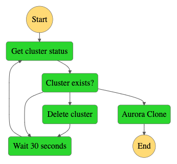

## aws-stepfunctions-aurora-clone

The goal of this project is to create an Aurora Clone using AWS StepFunctions so you can call it using an Amazon EventBridge Rule or from your CI/CD Pipeline.

You can check the main use cases for Aurora Clone [here.](https://docs.aws.amazon.com/AmazonRDS/latest/AuroraUserGuide/Aurora.Managing.Clone.html#Aurora.Clone.Overview)



The workflow is designed to guarantee a fresh clone, meaning it will delete the target cluster, if it exists, before cloning. This is particularly useful if you need to create clones on a schedule.

We provide a sample payload for the workflow execution, but you must change it to fit your scenario.

```typescript
const event = {
  SourceDBClusterIdentifier: "app-prod",
  TargetDBClusterIdentifier: "app-staging",
  TargetDBInstanceIdentifier: "app-staging-instance-1",
  TargetDBSubnetGroupName: "sample",
  TargetDBInstanceClass: "db.t4g.medium",
  TargetDBEngine: "aurora-postgresql",
  TargetVpcSecurityGroupIds: ["sg-0a1b2c3d"],
  TargetDBClusterParameterGroupName: "default.aurora-postgresql11",
  Port: 5432,
  TargetTags: [
    {
      Key: "Environment",
      Value: "staging",
    },
  ],
};
```

## Security

See [CONTRIBUTING](CONTRIBUTING.md#security-issue-notifications) for more information.

## License

This library is licensed under the MIT-0 License. See the LICENSE file.

